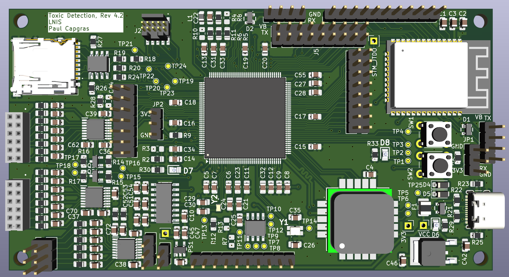
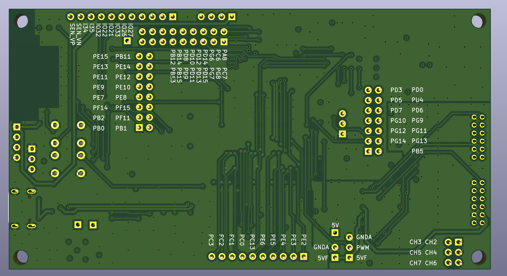

# Toxic-Detection-PCB

This project contains the Revision 4 for the PCB design of the AirU, ChemAirU, Toxic-Detection project.

As this project aims to create the revision 4, all documentation documents will starts at revision 4.0.

1. [Product Brief](/doc/product_brief.md)
2. [Design Notes](/doc/design_notes.md)
3. [Schematic v4.3](/doc/schematic_v4.3.pdf)
4. [Layout v4.2](/doc/layout_v4.2.pdf)

## Repo Organization

`./doc` -> documentations, components datasheets and libraries

`./Toxic_Detection_v4.0` -> Kicad files

## Next Steps

- [ ] Schematic under review
- [ ] Layout under review
- [ ] PCB order
