# Toxic Detection PCB - Schematic design notes

## Revision

| Revision | Date   | Author       | Comment     |
| -------- | ------ | ------------ | ----------- |
| v4.0     | 2026 Feb 10 | Paul Capgras | First draft |

## Purpose

The purpose of *Toxic Detection PCB - Schematic design notes* is to document the design choices and provide details on the project.

## Table of Content

## Component choice

All the key components are based on previous board design: Revision 3.3.

STM32H755ZIT3 is chosen as the Machine Learning applications have been tested on the Nucleo-h755zi development board which contains the STM32H755ZIT3.

## Electronic schematic

### STM32H755ZIT3

#### Power supply

According to the STM 32 power supply figure:

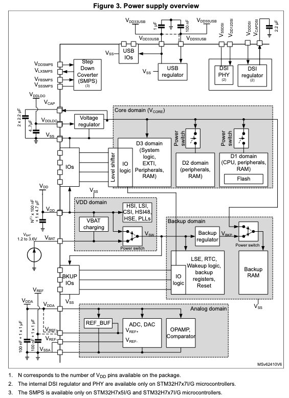

There are multiple key power domain:

1. VDD domain (clocks, Batterie charging, IOs ring) : It is powered by VDD (3.3V).
2. Analog domain : it is powered by (3.3VA).
3. Core domain : it can be powered by internal SMPS or internal LDO. Default configuration is SMPS (3.3V input, Vcore at 1.2V).
4. USB power domain: not used in this board.

Schematic:
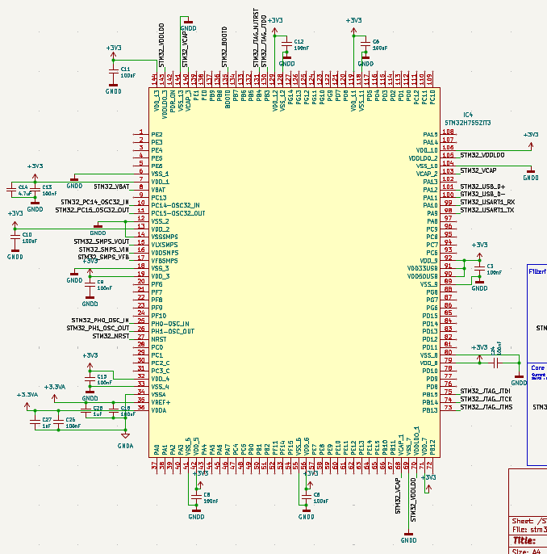
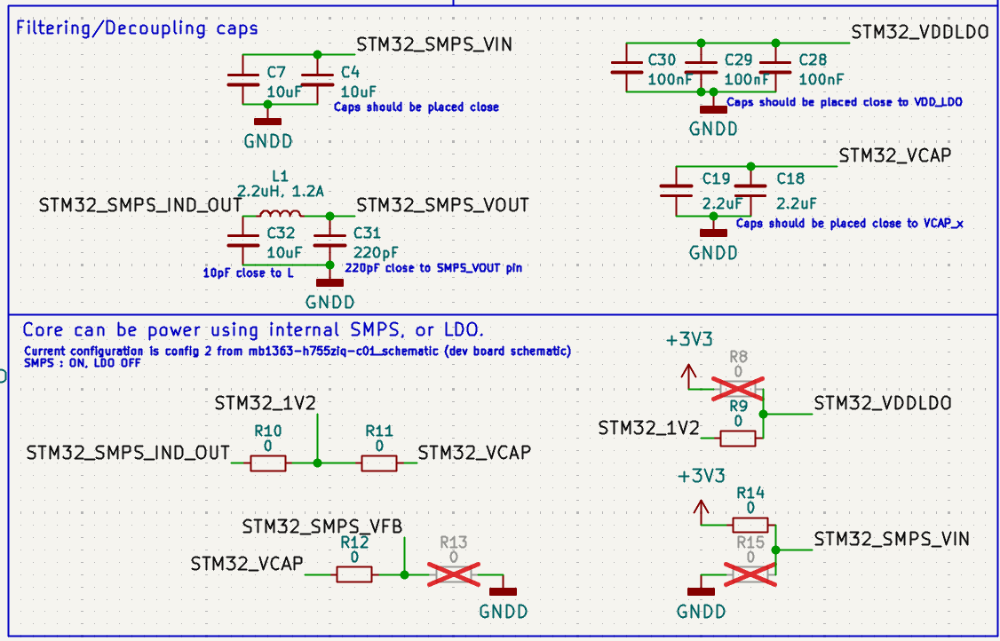

Reference:
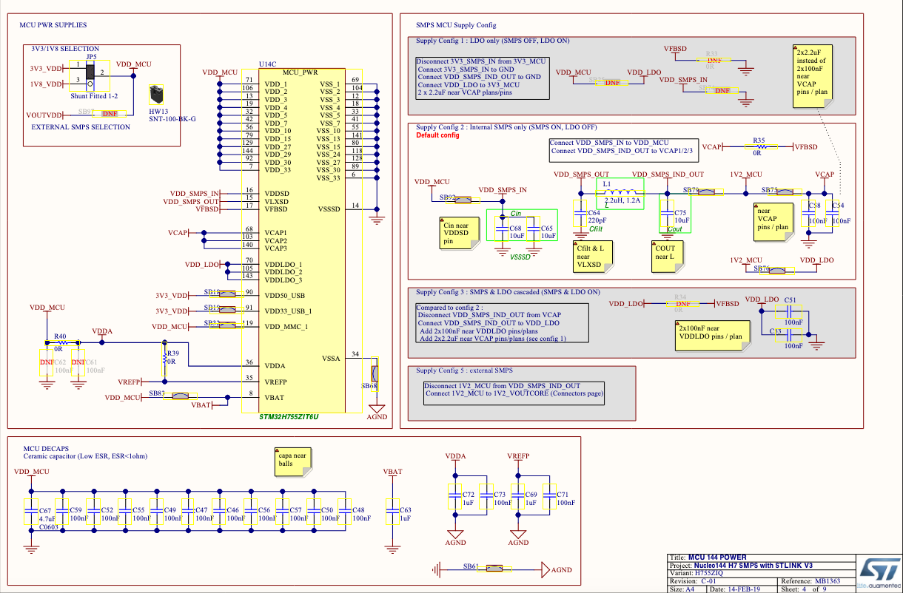

#### Bootloading

This section is based on [AN2606](components/STM32H755/an2606-stm32-microcontroller-system-memory-boot-mode-stmicroelectronics.pdf).

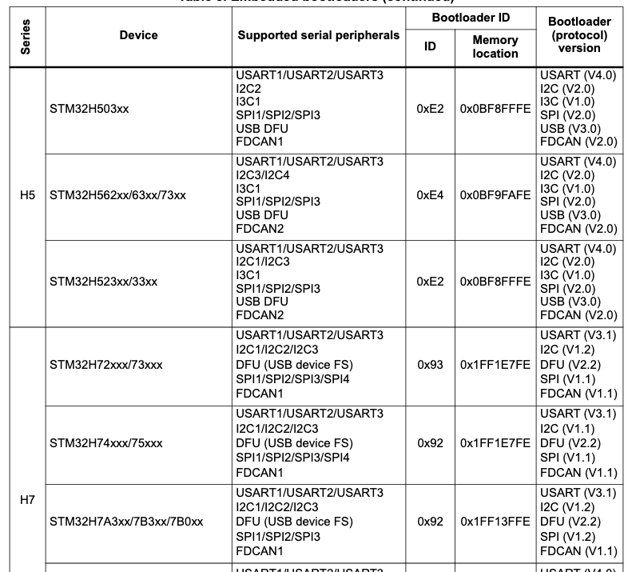

It is should be possible to boot with UART, I2C, USB, SPI.
Let's setup UART and USB for this board.

1. USB:
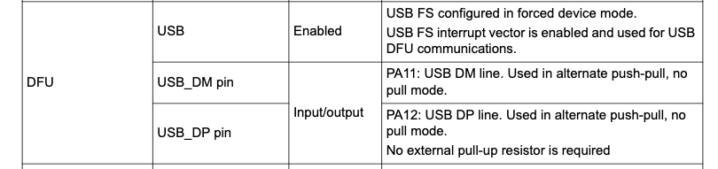

2. UART:
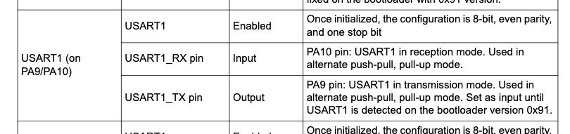

3. SPI:
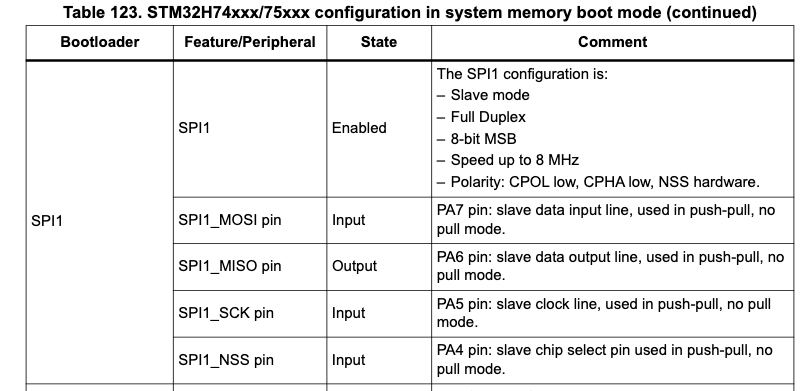

Schematic:
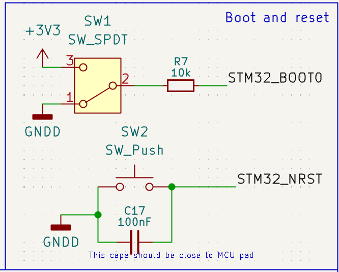


References:
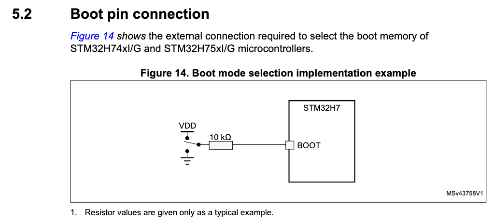

#### Clocks

Schematic:
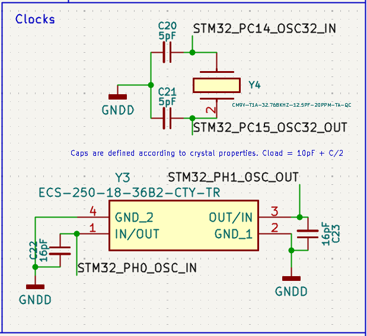

References:
It is based on [AN4938](components/STM32H755/an4938-getting-started-with-stm32h74xig-and-stm32h75xig-mcu-hardware-development-stmicroelectronics.pdf).

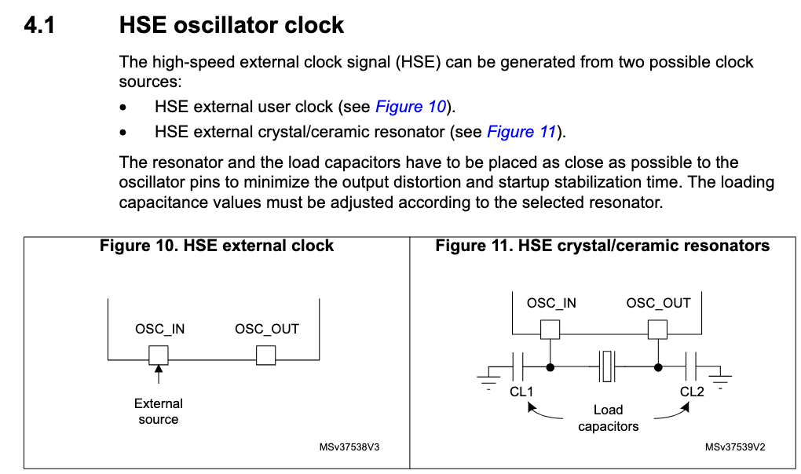

Section 4.1.2 of :
```
The external oscillator frequency ranges from 4 to 48 MHz. The external oscillator has the advantage of producing a very accurate main clock. The associated hardware configuration is shown in Figure 11. Using a 25 MHz oscillator frequency is a good choice to get accurate Ethernet, USB OTG high-speed peripheral, I2S, and SAI.
The resonator and the load capacitors have to be connected as close as possible to the oscillator pins to minimize the output distortion and startup stabilization time. The load capacitance values must be adjusted according to the selected oscillator.
For CL1 and CL2 it is recommended to use high-quality ceramic capacitors in the 5 pF to 25 pF range (typical), designed for high-frequency applications and selected to meet the requirements of the crystal or resonator. CL1 and CL2 are usually the same value. The crystal manufacturer typically specifies a load capacitance that is the series combination of CL1 and CL2. The PCB and MCU pin capacitances must be included when sizing CL1 and CL2 (10 pF can be used as a rough estimate of the combined pin and board capacitance).
```

Datasheet for the 25MHz clock (HSE): [ECX_2236B2](components/Quartz%2025MHz/ECX_2236B2.pdf).
The Load capacitance of this clock is 18pF (its in the name, do not refer to datasheet). So the Capacitors are 16pF to have `18 = 10 + 16/2`

Datasheet for the 32.768kHz clock(OSC32): [CM9V-T1A](components/Quartz%2032.768KHz/CM9V-T1A.pdf).
The load capacitance of this clock is 12.5pF. So the capacitors are 5pF to have `12.5 = 10 + 5/2`

#### Debug

JTAG interface:

Schematic:
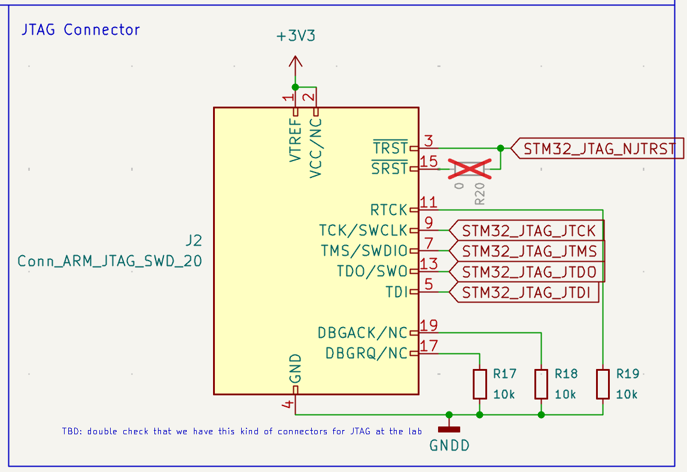
References:
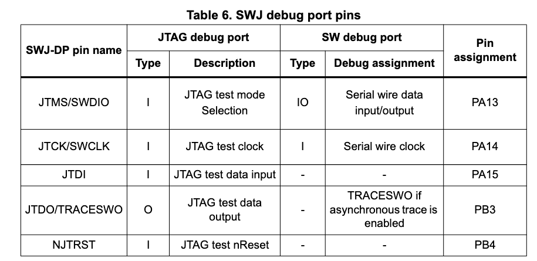
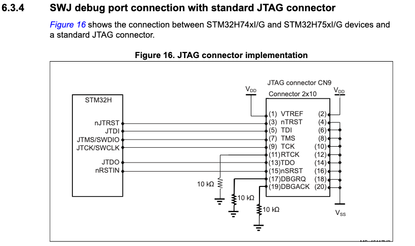

### AFE connectors

Schematic:
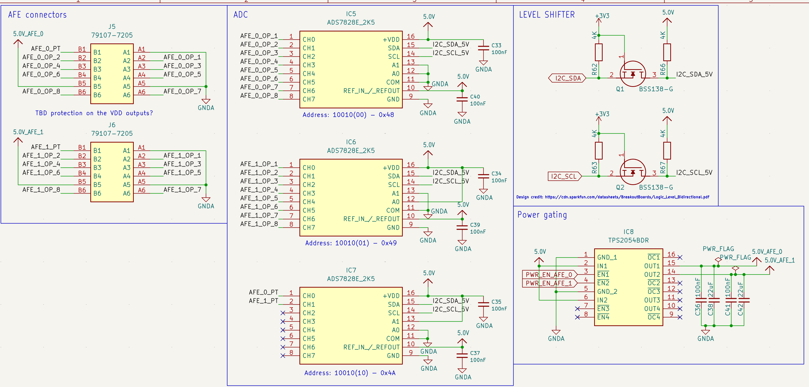

References:
This design is based on the previous board revision (3.3), on [AFE Datasheet](external/alphasense_afe_datasheet_en_1.pdf) and components datasheets.
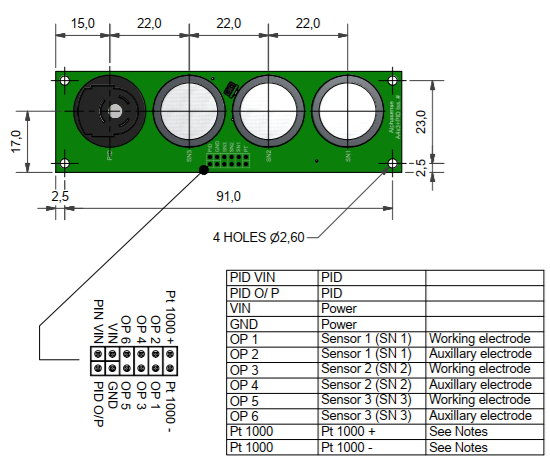


### LDOs

Schematic:
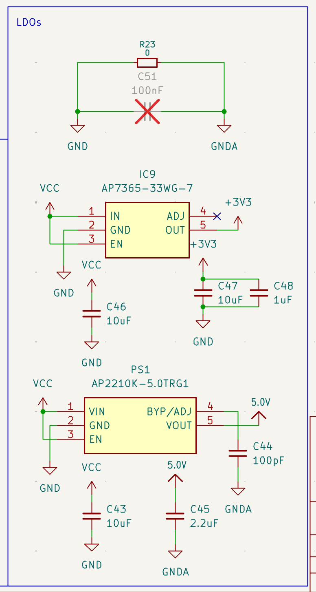

References:
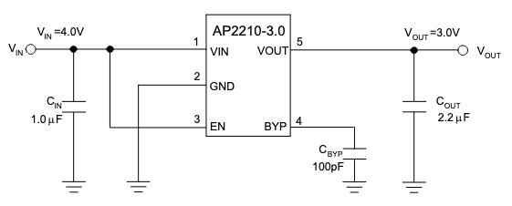
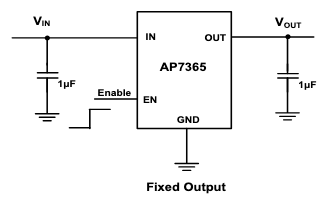

Note [Datasheet LDO 3.3V](components/LDO%203.3V/DIOD-S-A0003512613-1.pdf) says that pin 4 should be unconnected when using a fix LDO.

### Power Gating

Schematic:
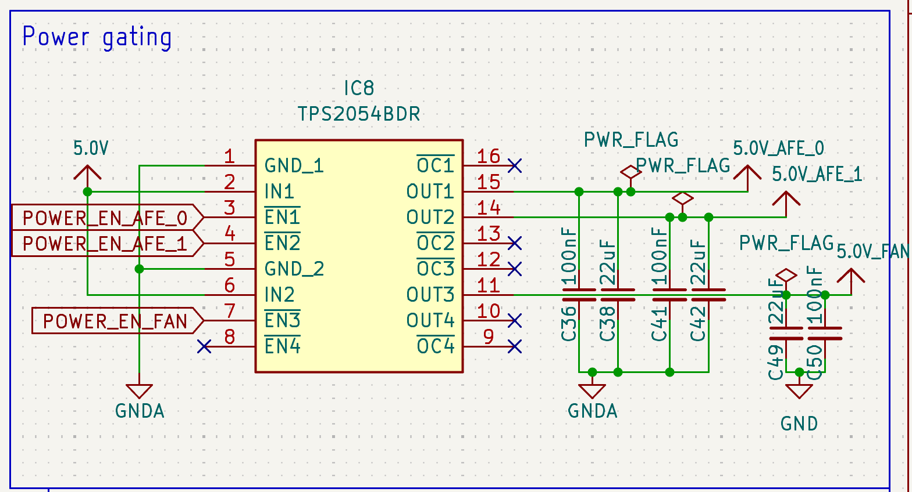

References:
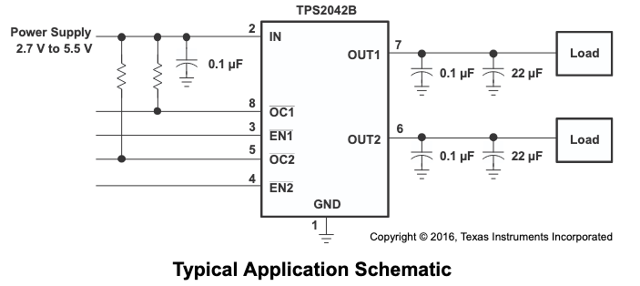

## ESP32 Pin Assignments

This table contains all the pin assignments.

SD_CD
SD_CMD
SD_CLK
SD_D0

|IO°             |Type | Active Mode    | Debug/Bringup|
|----------------|-----|----------------|--------------|
| IO0            | I/O |                |              |

