# Toxic Detection PCB - Schematic design notes

## Revision

| Revision | Date        | Author       | Comment                  |
| -------- | ----------- | ------------ | ------------------------ |
| v4.0     | 2026 Feb 12 | Paul Capgras | First draft : Pre-Layout |
| v4.1     | 2026 Feb 17 | Paul Capgras | Post-Layout              |

## Related Documents

- [Product Brief](product_brief.md).
- All components datasheets, reference manuals, evaluation boards available in `doc/components/`.
- Alphasense sensors' datasheets.

## Purpose

The purpose of *Toxic Detection PCB - Schematic design notes* is to document the design choices and provide details on the project.

---

## Table of Content

1. [Features](#1-features)
2. [Architecture](#2-architecture)
3. [Component choice](#3-component-choice)
4. [Schematic](#4-schematic)
    1. [Microcontroller - STM32H755ZIT3](#41-microcontroller---stm32h755zit3)
        1. [STM32 - Power Supply](#411-stm32---power-supply)
        2. [STM32 - Booting and programming](#412-stm32---booting-and-programming)
        3. [STM32 - Clocks](#413-stm32---clocks)
        4. [STM32 - Debug](#414-stm32---debug)
        5. [STM32 - Flash](#415-stm32---flash)
    2. [Analog Front End](#42-analog-front-end)
    3. [LDOs](#43-ldos)
    4. [Power Gating](#44-power-gating)
    5. [WiFi module - ESP32-WROOM-32E-N16](#45-wifi-module--esp32-wroom-32e-n16)
        1. [ESP32 - Booting and programming](#451-esp32---booting-and-programming)
        2. [ESP32 - Debug](#452-esp32---debug)
        3. [STM32 - ESP32 communication](#453-stm32---esp32-communication)
        4. [ESP32 - Pin assignments](#454-esp32---pin-assignments)
    6. [GNSS module and antenna - SAM-M10Q](#46-gnss-module-and-antenna---sam-m10q)
    7. [MicroSD card](#47-microsd-card)
    8. [Debug Features](#48-debug-features)
    9. [Shematic Revision 4.0](#49-schematic-revision-40)
5. [Layout](#5-layout)

---

## 1. Features

- Toxic-Detection-PCB supports 2 sets of 4 chemical sensors from Alphasense.
- Toxic-Detection-PCB integrates an high performance microcontroller (STM32H755).
- Toxic-Detection-PCB can communicate via WiFi, Bluetooth v4.2 and BLE (ESP32).
- Toxic-Detection-PCB supports concurrent reception of four GNSS (GPS, GLONASS, Galileo, and BeiDou).
- Toxic-Detection-PCB is powered through USB-C connector, or via 5V UARTs.
- Toxic-Detection-PCB is reprogrammable: ESP32 is programmable with UART, STM32 is programmable with UART and USB 2.0. Note: Programming thanks to usb can be disable.
- Toxic-Detection-PCB provide power for a 5V-fan.
- STM32 and ESP32 can be debugged via JTAG.
- STM32 have access to a 2MB internal flash, 32MB external flash (QSPI), MicroSD card (SDMMC 4 lines).
- Toxic-Detection-PCB embedded protection against short ciruits (1A fuse), return currents, ESD (on UARTs, USB, SD card).
- Toxic-Detection-PCB can turnoff power for each Analog Front End and for the fan.
- Toxic-Detection-PCB includes 1 red and 2 green LEDs. The red led indicates the board is powered and there are no short circuit detected. The 1rst green led is controlled by the ESP32, the 2nd by the STM32. It is up to the user to define their meaning.
- Unused GPIOs of STM32, ESP32 and channels of ADCs are routed to headers.

---

## 2. Architecture

Simplified architecture diagram:


Complete architecture diagram:
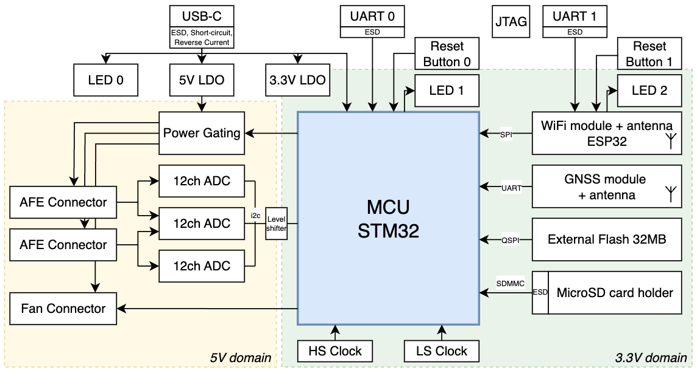

---

## 3. Component choice

Many components are based on the previous board design: Revision 3.3 (April 2024) and Revision 3.3.1 (August 2024).

- MCU: STM32H755ZIT3 is chosen as the Machine Learning applications have been tested on the Nucleo-h755zi development board which contains the STM32H755ZIT3.
- WIFI: ESP32-WROOM-32E is picked because it is easy to use.
- GNSS: SAM-M10Q is selected because it includes both GNSS module and antenna.

---

## 4. Schematic

### 4.1 Microcontroller - STM32H755ZIT3

#### 4.1.1 STM32 - Power supply

According to the STM 32 power supply figure:


There are multiple key power domain:

1. VDD domain (clocks, Batterie charging, IOs ring) : It is powered by VDD (3.3V).
2. Analog domain : it is powered by (3.3VA).
3. Core domain : it can be powered by internal SMPS or internal LDO. Default configuration is SMPS (3.3V input, Vcore at 1.2V).
4. USB power domain: not used in this board.

Schematic:


Reference:


#### 4.1.2 STM32 - Booting and programming

This section is based on [AN2606](components/STM32H755/an2606-stm32-microcontroller-system-memory-boot-mode-stmicroelectronics.pdf).


It is should be possible to boot with UART, I2C, USB, SPI.
Let's setup UART and USB for this board.

1. USB:


2. UART:


3. SPI:


Schematic:


References:


#### 4.1.3 STM32 - Clocks

Schematic:


References:
It is based on [AN4938](components/STM32H755/an4938-getting-started-with-stm32h74xig-and-stm32h75xig-mcu-hardware-development-stmicroelectronics.pdf).


Section 4.1.2 of :

```md
The external oscillator frequency ranges from 4 to 48 MHz. The external oscillator has the advantage of producing a very accurate main clock. The associated hardware configuration is shown in Figure 11. Using a 25 MHz oscillator frequency is a good choice to get accurate Ethernet, USB OTG high-speed peripheral, I2S, and SAI.
The resonator and the load capacitors have to be connected as close as possible to the oscillator pins to minimize the output distortion and startup stabilization time. The load capacitance values must be adjusted according to the selected oscillator.
For CL1 and CL2 it is recommended to use high-quality ceramic capacitors in the 5 pF to 25 pF range (typical), designed for high-frequency applications and selected to meet the requirements of the crystal or resonator. CL1 and CL2 are usually the same value. The crystal manufacturer typically specifies a load capacitance that is the series combination of CL1 and CL2. The PCB and MCU pin capacitances must be included when sizing CL1 and CL2 (10 pF can be used as a rough estimate of the combined pin and board capacitance).
```

Datasheet for the 25MHz clock (HSE): [ECX_2236B2](components/Quartz%2025MHz/ECX_2236B2.pdf).
The Load capacitance of this clock is 18pF (its in the name, do not refer to datasheet). So the Capacitors are 16pF to have `18 = 10 + 16/2`

Datasheet for the 32.768kHz clock(OSC32): [CM9V-T1A](components/Quartz%2032.768KHz/CM9V-T1A.pdf).
The load capacitance of this clock is 12.5pF. So the capacitors are 5pF to have `12.5 = 10 + 5/2`

#### 4.1.4 STM32 - Debug

JTAG interface:
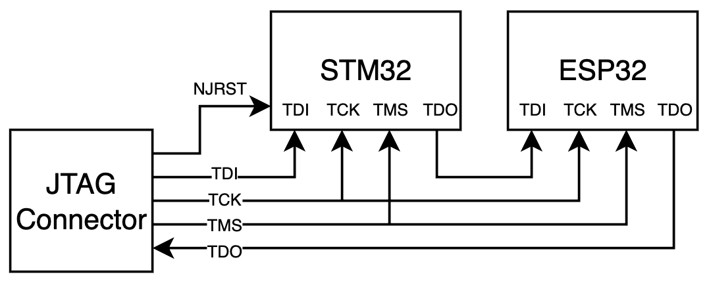

Schematic:

References:


#### 4.1.5 STM32 - Flash

An external 32MB NOR flash is added.

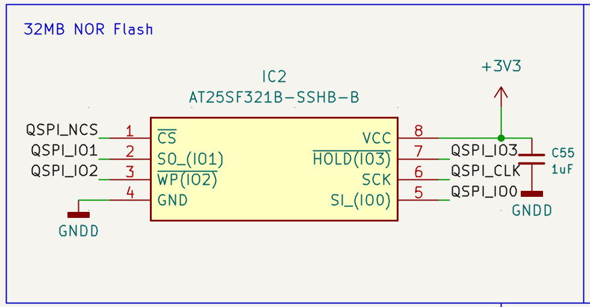

### 4.2 Analog Front End

Schematic:


References:
This design is based on the previous board revision (3.3), on [AFE Datasheet](external/alphasense_afe_datasheet_en_1.pdf) and components datasheets.


### 4.3 LDOs

Schematic:


References:


Note [Datasheet LDO 3.3V](components/LDO%203.3V/DIOD-S-A0003512613-1.pdf) says that pin 4 should be unconnected when using a fix LDO.

### 4.4 Power Gating

Schematic:


Note: The enable signal is considered high if the voltage is above 2.7V so there is no need for a level shifter here as the STM32 is producing a 3.3V level.

References:


### 4.5 WiFi Module : ESP32-WROOM-32E-N16

#### 4.5.1 ESP32 - Booting and programming

Schematic:
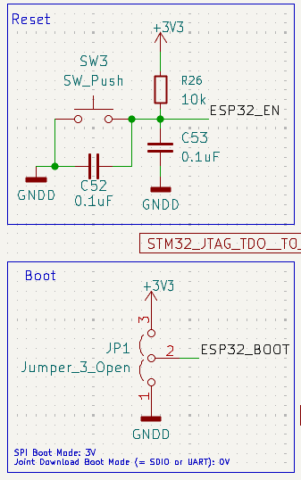

To program the ESP32:

- First, connect ESP32_BOOT to GND using the jumper.
- Then program the 16MB flash using UART.
- Finally, put the jumper back to 3.3v to boot from the flash that has been programmed.

References:

- DevKitC V4.

#### 4.5.2 ESP32 - Debug

Debug can be performed via JTAG. See [STM32 debug section](#414-stm32---debug).

#### 4.5.3 STM32 - ESP32 communication

To communicate with the ESP from the STM32, decision is made to use SPI because it is fast and the ESP32 has SPI slave available natively.

References:
The General Purpose SPI can behave in slave mode. For them any GPIO is possible, however for best performance, it is better to use parallel QSPI pins. Since HSPI pins are used by JTAG, decision is made to use the VSPI pins.
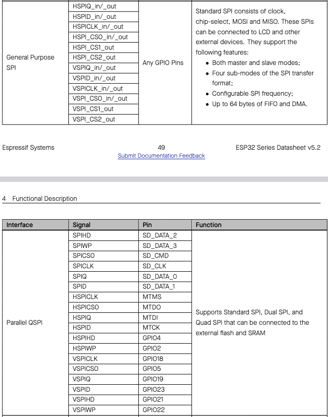

Schematic:
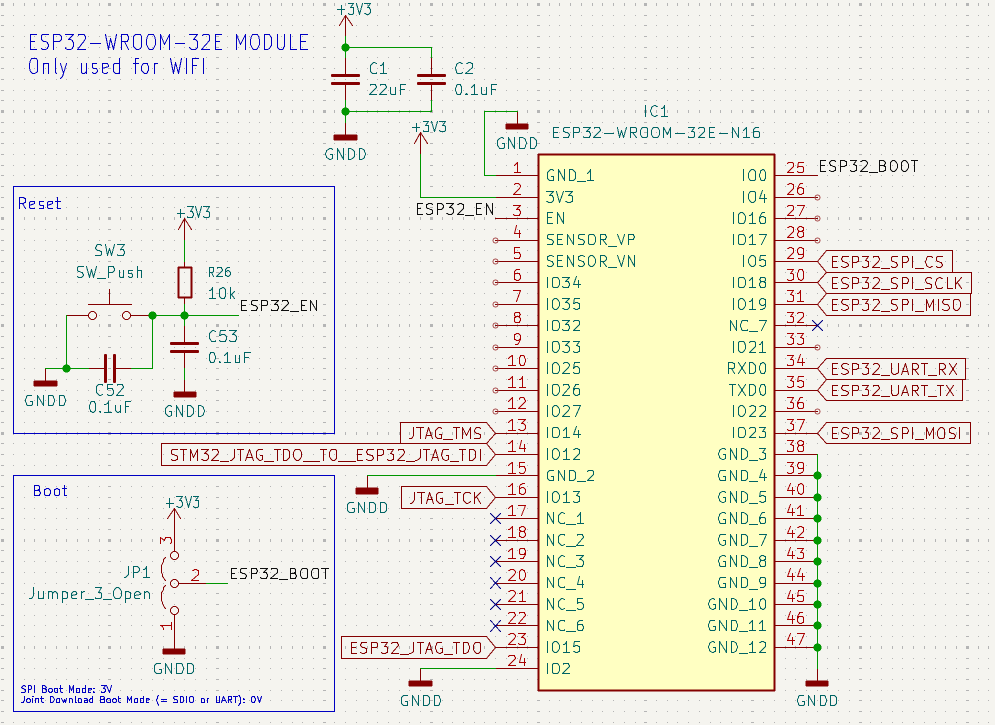

#### 4.5.4 ESP32 - Pin assignments

This table contains all the pin assignments. It was updated during layout to make rooting easier.

|IO°             |Type | Active Mode       | Debug/Bringup |
|----------------|-----|-------------------|---------------|
| IO0            | I/O |                   | booting       |
| IO1 TXD0       | I/O |                   | esp32_uart_tx |
| IO2            | I/O |                   | booting       |
| IO3 RXD0       | I/O |                   | esp32_uart_rx |
| IO4            | I/O | stm32_esp32_irq_2 |               |
| IO5            | I/O | esp32_spi_cs      |               |
| IO12           | I/O |                   | jtag_tdi      |
| IO13           | I/O |                   | jtag_tck      |
| IO14           | I/O |                   | jtag_tms      |
| IO15           | I/O |                   | jtag_tdo      |
| IO16           | I/O | esp32_led_0       |               |
| IO17           | I/O | stm32_esp32_irq_1 |               |
| IO18           | I/O | esp32_spi_sclk    |               |
| IO19           | I/O | esp32_spi_miso    |               |
| IO21           | I/O |                   |               |
| IO22           | I/O |                   |               |
| IO23           | I/O | esp32_spi_mosi    |               |
| IO25           | I/O |                   |               |
| IO26           | I/O |                   |               |
| IO27           | I/O |                   |               |
| IO32           | I/O |                   |               |
| IO33           | I/O |                   |               |
| IO34           | I   |                   |               |
| IO35           | I   |                   |               |
| IO36 SENSOR_VP | I   |                   |               |
| IO39 SENSOR_VN | I   |                   |               |

### 4.6 GNSS module and antenna - SAM-M10Q

Schematic:
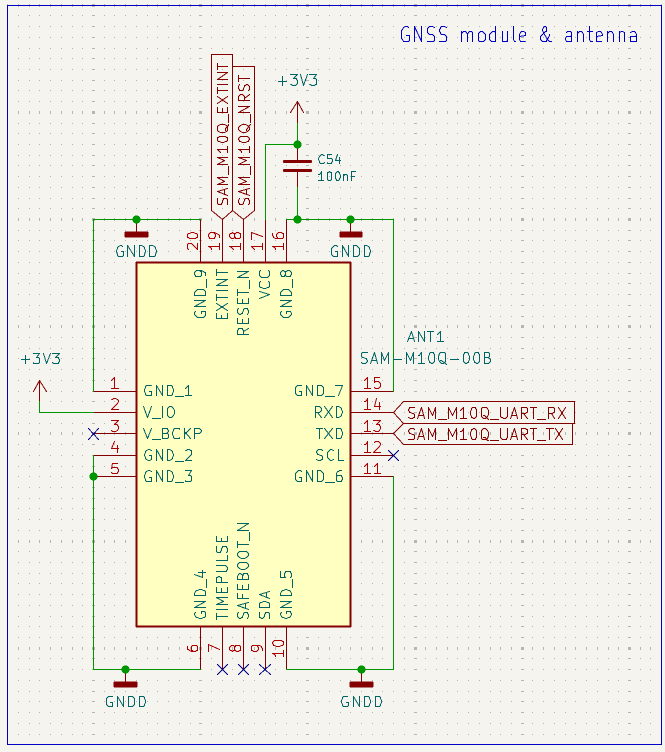

References:
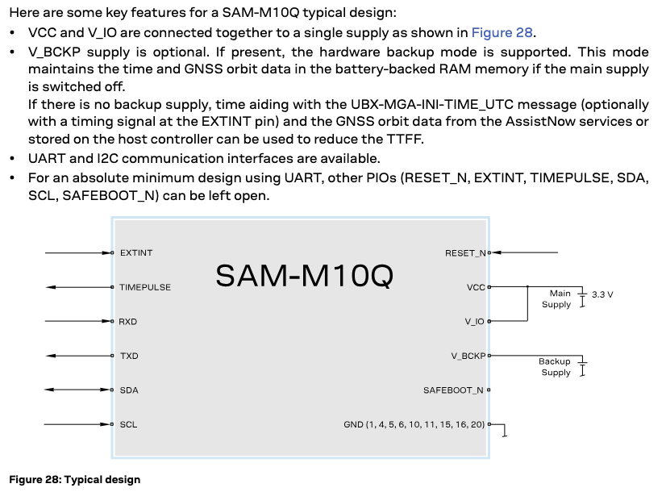

### 4.7 MicroSD card

Schematic:
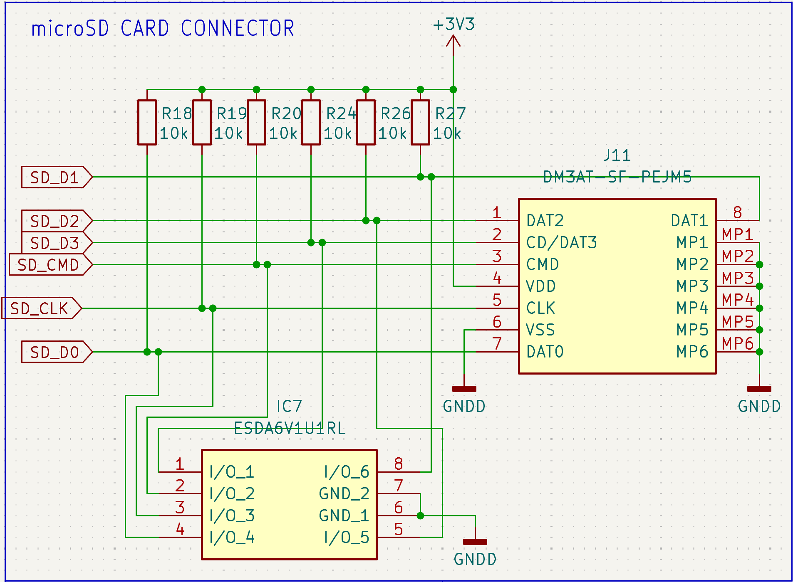

### 4.8 Debug features

Debug through JTAG is possible see [STM32 Debug](#414-stm32---debug), [ESP32 Debug](#452-esp32---debug).

Test points have been added to:

- monitor SDMMC bus (STM32-MicroSD)
- monitor fuse voltage
- monitor UART (STM32-GNSS module)
- monitor SPI (STM32-ESP32)
- monitor I2C both before and after level shifter (STM32-ADCs)
- monitor QSPI (STM32-Flash)
- monitor quartz

Optional 2.54mm Header have added to:

- monitor/force power
- monitor JTAG  transmit JTAG to each chip individually.

### 4.9 Schematic Revision 4.0

[Schematic Revision 4.0](schematic_v4.0/Toxic_Detection_v4.0.pdf)

---

## 5. Layout

### 5.1 Placement

First idea:
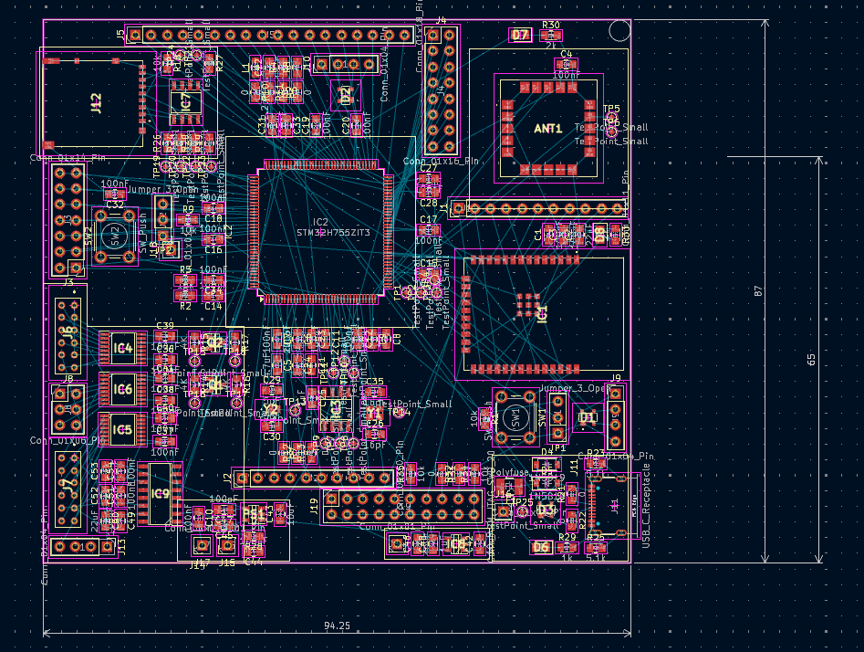
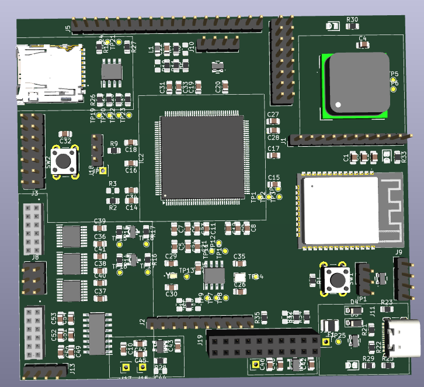

Second idea:
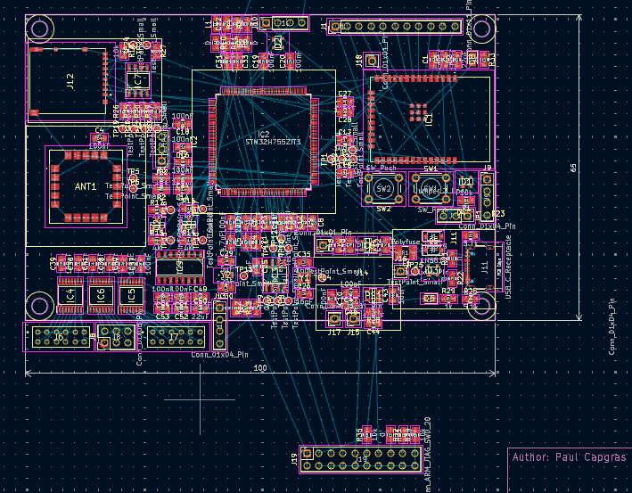
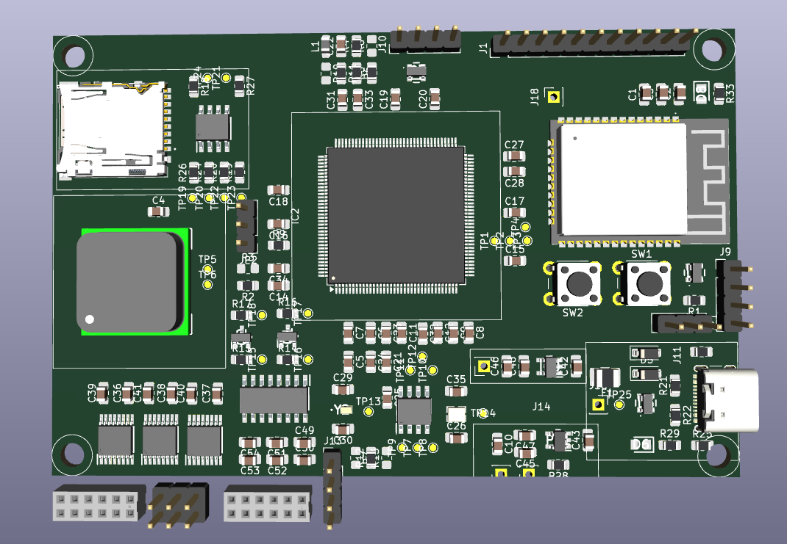

Third (and final) idea:
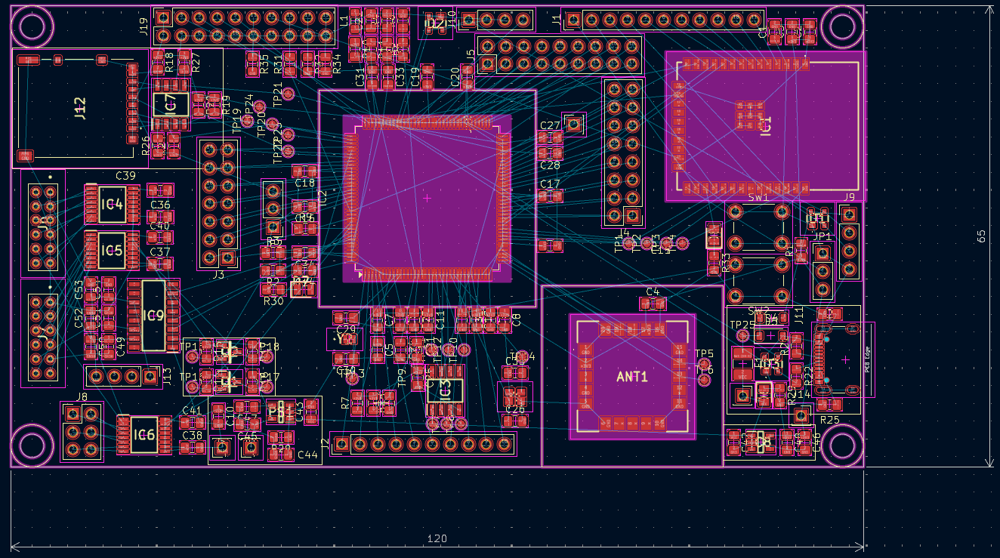
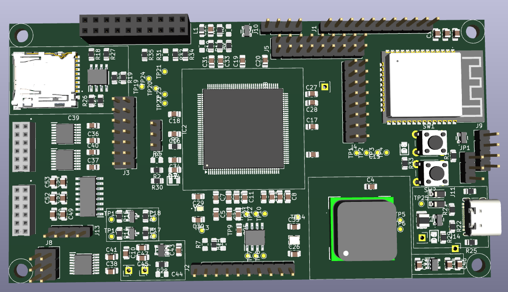

### 5.2 Routing

The following design was made so that all QSPI have a length around 27mm.
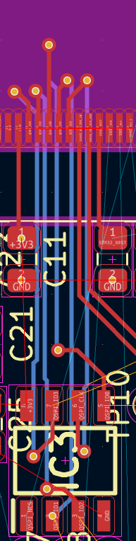

Same for SPI between STM32 and ESP32
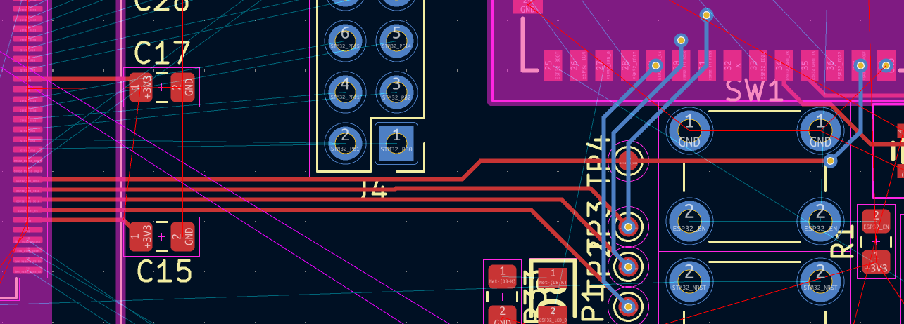

Same for SDMMC
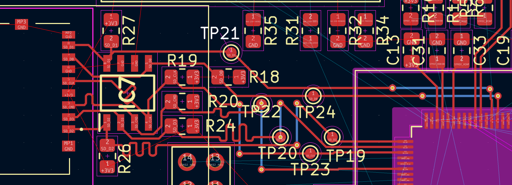

Finally all the other lines are routed.

### 5.3 Update footprints for debug

The goal here is to edit some footprints to make rework easier.


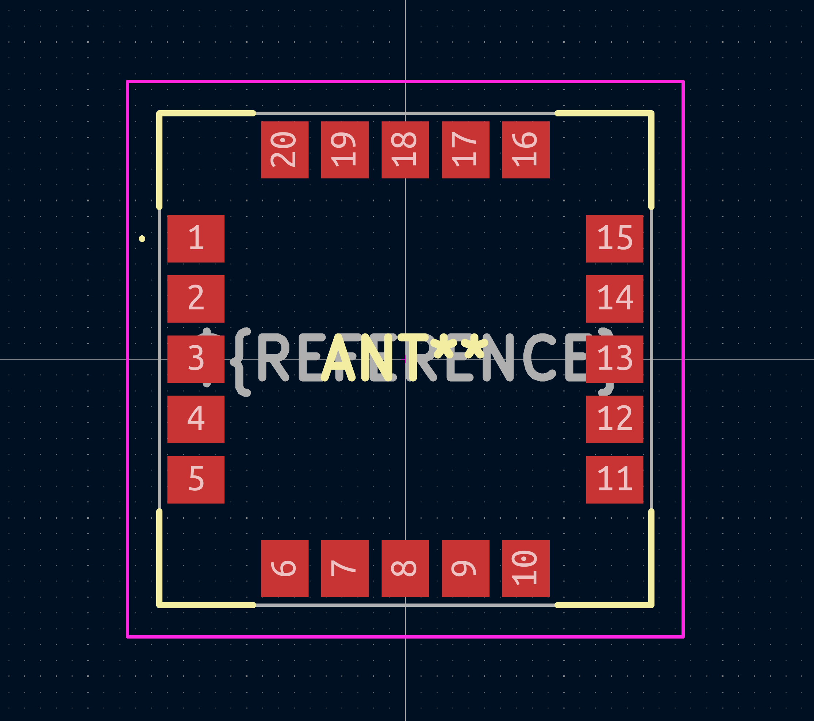
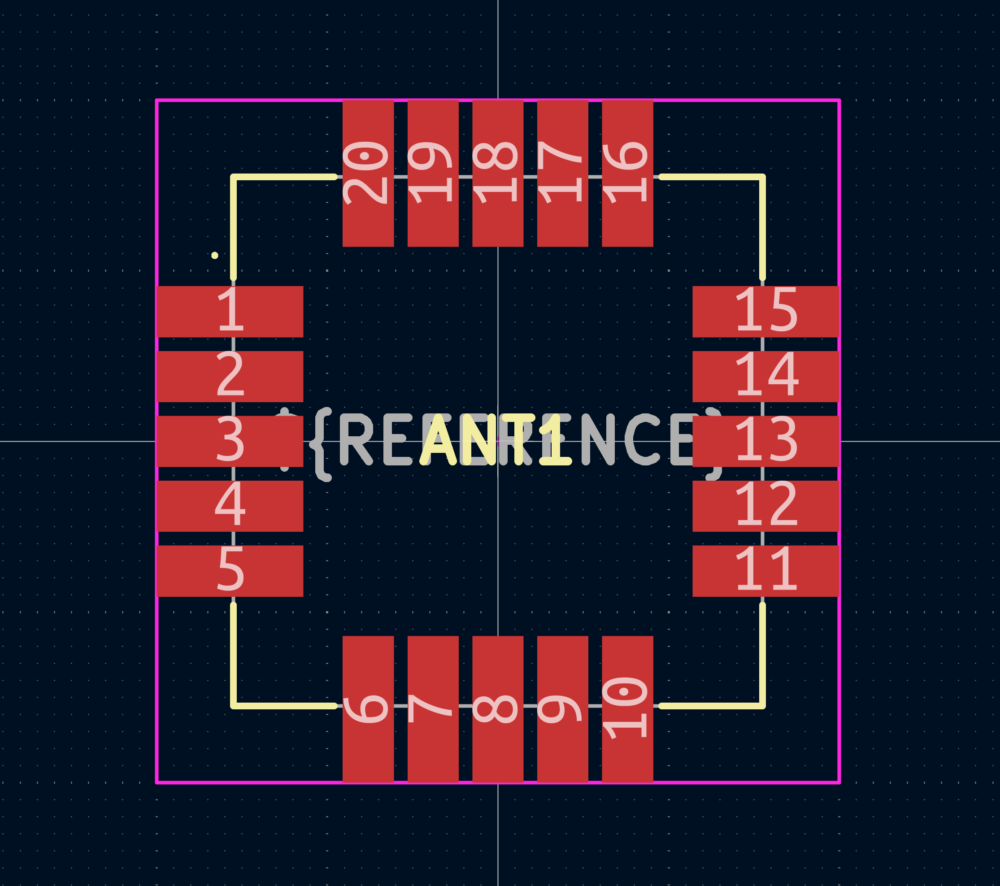

### 5.4 Impedance matching

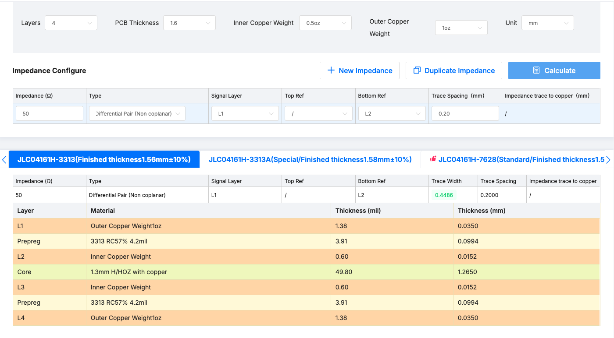

USB lines should be 50 Ohms. The differential pair is then routed with a gap of 0.2mm and a width of 0.4486mm.

A length matching was also required to have a total length of each lines of 95mm.

### 5.4 Final Layout

Layout so far:


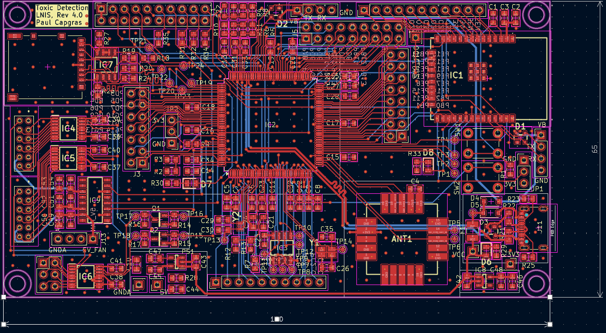
