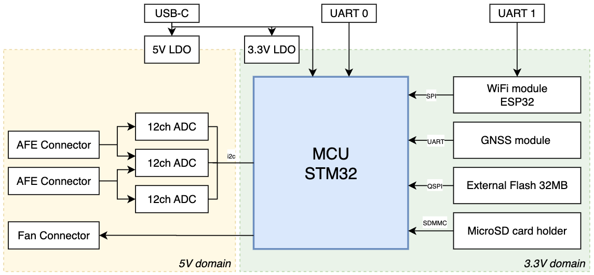

# Toxic-Detection-PCB – Product Brief

## Revision

| Revision | Date   | Author       | Comment     |
| -------- | ------ | ------------ | ----------- |
| v4.0     | 2025, Oct 16 | Paul Capgras | First draft |
| v4.1     | 2025, Nov 10 | Paul Capgras | Take into account review from Tharnath, Raven and PE. |
| v4.2     | 2026, Feb 12 | Paul Capgras | Update architecture diagram |

---

## 1. Motivation

This project aims to design a new PCB to interface with **2 sets of 4 chemical sensors** used to detect toxic gases in the air.

The previous electronic interface, **TELLUS Network Sensor Solutions (rev. 3.2)**, is now limited because it provides only one interface for the sensor AFE, thus supporting only four sensors instead of eight.
The current workaround uses **two TELLUS boards** connected in a controller/target architecture.

In parallel, the first AI models have been developed and deployed on an **STM32** to perform real-time toxic gas detection. These algorithms were tested on an STM32 development board but **cannot be embedded** in the current TELLUS board, as the onboard **ESP32** MCU is not powerful enough to run this new software.

A new revision of the TELLUS board is therefore required, with two main goals:

* Support **2 sets of 4 chemical sensors** by providing two AFE interfaces.
* Integrate a **computing chip powerful enough** to handle the new software requirements.

---

## 2. Functional Description

The device will interface with **two sets of four chemical sensors** and **one temperature sensor**.

* Every **10 seconds**, a measurement of the eight sensors is performed.
* Every **minute**, a Wi-Fi communication occurs to push data to:

  * **Mode 1:** the cloud database, or
  * **Mode 2:** a local computer connected via Wi-Fi.

Measurement includes the device position using GNSS.

Data processing can also be enabled and performed on the onboard MCU before transmission via Wi-Fi.

The device will be **powered through a USB-C connector**. The external power source (transformer or battery) is **out of scope** for this project.

The device will include a **computing chip powerful enough to run small AI models**, such as the **STM32H755**.
It will be **reprogrammable** as many times as the user desires.

Additional features:

* Provide **power for a ventilator**.
* Optionally support a **LoRa connection**.

---

## 3. Electrical Specifications

* **Input power:** 5 V via USB-C connector
* **Maximum power consumption:** TBD

---

## 4. Mechanical and Form Factor

* **Board dimensions:** Must fit within the predefined box (TBD).
* **Mounting holes:** Yes (4 total, size TBD).
* **Connector placement constraints:** None.
* **Other mechanical constraints:** None.

---

## 5. Interface & Connectivity

* 2 interfaces for 4-sensor AFEs
* 1 interface to power a ventilator
* 1 GNSS device
* 1 SD card device
* 1 EEPROM / flash
* 1 LoRa interface (optional)
* 1 USB-C connector for power
* Programming/debug interfaces

---

## 6. System Block Diagram

---

## 7. Design Constraints

* **PCB layers:** Up to 4
* **EMI/EMC requirements:** None
* **Safety certifications:** None
* **Standard certifications:** None
* **ESD protection:** Yes, where required

---

## 8. Power Architecture

No specific requirements at this stage.

---

## 9. Firmware / Software Considerations

* Existing projects were developed using **ESP32-WROOM** and **STM32H755**.
* The Wi-Fi stack uses **MQTT** protocol.

---

## 10. Testing & Validation

* All signals should be accessible for probing.
* All power lines should be easily accessible.
* The debug bus should be clearly exposed for observation.

---

## 11. Deliverables

* Component selection
* Schematic
* Schematic design notes
* PCB layout
* Layout design notes
* Bill of Materials (BOM)
* Gerber files

---

## 12. Manufacturing & Assembly

* **Manufacturing:** External
* **Assembly:** TBD (to decide whether in-lab or outsourced)

---

## 13. Questions

The **TELLUS Network Sensor Solutions board** includes more features than required for this project (see [Motivation](#1-motivation)).
Unless stated otherwise, these will **not be retained**.

| Feature                                | Keep? |
| -------------------------------------- | ----- |
| Microphone                             | No    |
| Temperature & humidity sensor          | No    |
| PM sensor connector (MOLEX-53261-0871) | No    |
| User button                            | No    |
| Thermal probe                          | No    |
| eSIM interface                         | No    |
| GNSS antenna                           | No    |
| Main antenna                           | No    |
| BG77 module                            | No    |
| GPS module                             | No    |
| GPS antenna                            | No    |

**A GNSS module should be kept.**

## Appendix

### Why a measurement every 10 seconds?

Because real-time operation is required for many applications, and the evolution of air composition is slow enough to justify a sampling frequency of **0.1 Hz**.

### Why can’t we process the data in the cloud?

Because the project targets applications that may **not have cloud connectivity** and might require **immediate, local alerts** (e.g., alarms, warning lights).

### Should we include a **microSD card connector**?

Yes.

### Will the PCB be **assembled in the lab** or externally?

In house for prototyping, external for production.

### What is the confidentiality level of the project? Once finished, can it be open-source?
